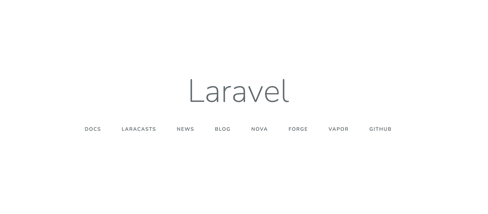
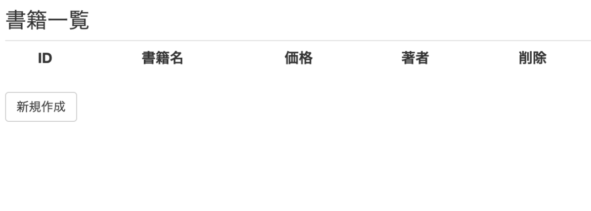

# 書籍管理アプリ(cloud9)2

## 0. 目次
[1.環境構築](#1-環境構築)

[2.DBの準備](#2-DBの準備)

[3.書籍一覧画面の作成](#3-書籍一覧画面の作成)
 
[4.書籍登録画面の作成](#4-書籍登録画面の作成)
 
[5.書籍登録機能の作成](#5-書籍登録機能の作成)

[6.書籍編集画面の作成](#6-書籍編集画面の作成)

[7.編集機能の作成](#7-編集機能の作成)

[8.削除機能の作成](#8-削除機能の作成)

## 1. 環境構築

### 1.テンプレートリポジトリのコピー

[こちらからGitHubへ！！](https://github.com/tech-quest-school/docker-laravel-template)

### 2.Dockerインストール＆起動

### 3.Laravelプロジェクトの新規作成

`$ make create-project`

Dockerの起動やLaravelのインストールを自動でやってくれています。

### 4.プロジェクトの新規作成ができているか確認

①Webサーバーの起動

`$ php artisan serve --port=8080`

②ブラウザーに表示

> ブラウザ画面


## 2. DBの準備

### 1.Docker内のDBコンテナを起動

$ docker-compose exec db bash

### 2MySQL にログインする

mysql> mysql -u root -p

パスワードを求められるかと思いますが、空白で Enter 押しちゃってください。

### 3.データベースを作成する

mysql> create database laravel;

今回は laravel という名前のデータベースを作成しました。

### 4.作成したデータベースを確認する

mysql> show databases;

### 5.作成したデータベースを選択する

mysql> use laravel

### 6.データベーステーブルを確認する

mysql> show tables;

Empty set (0.00 sec)
とありますのでまだテーブルはないことが確認できます。
ここからデータベースマイグレーションでテーブルを作成していきますので MySQL からログアウトします。

### 7.MySQL からログアウト

mysql> exit;

### 8.Docker内のDBコンテナを停止

root@f9f404343179:/# exit;

### 2.マイグレーション

①Dockerのappコンテナを起動
`$ docker-compose exec app bash`

②booksテーブルを作成

`$ php artisan make:migration create_books_table --create=books`

③booksテーブルのupメソッドの修正

[database/migrations/yyyy_mm_dd_hhssmm_create_books_table.php]

```php
<?php

use Illuminate\Database\Migrations\Migration;
use Illuminate\Database\Schema\Blueprint;
use Illuminate\Support\Facades\Schema;

class CreateBooksTable extends Migration
{
    /**
     * Run the migrations.
     *
     * @return void
     */
    public function up()
    {
        Schema::create('books', function (Blueprint $table) {
            /*
            *  以下のようにテーブルに持たせる項目を書きます。
            */
            $table->increments('id');
            $table->string('title', 100);
            $table->string('author', 50);
            $table->integer('price');
            $table->text('comment')->nullable();
            $table->timestamps();
        });
    }

    /**
     * Reverse the migrations.
     *
     * @return void
     */
    public function down()
    {
        Schema::dropIfExists('books');
    }
}
```

④マイグレーションの実行

`$ php artisan migrate`

⑤.Docker内のappコンテナを停止

`root@f9f404343179:/# exit`

### 3.マイグレーションができたかの確認

①1.Docker内のDBコンテナを起動

`$ docker-compose exec db bash`

2.MySQL にログインする

``root@f9f404343179:/# mysql -u root -p`

パスワードを求められるかと思いますが、空白で Enter 押しちゃってください。

3.laravelデータベースを選択する

`mysql>  use laravel;`

4.データベーステーブルを確認する

`mysql> show tables;`

5.booksテーブルが指定通り作成されているか確認

`mysql> DESC books;`

6.MySQL からログアウト

`$ exit;`

7.Docker内のDBコンテナを停止

`root@f9f404343179:/# exit;`

## 3. 書籍一覧画面の作成

### 1.Modelの作成

`% docker-compose exec app php artisan make:model Book`

### 2.Modelが作成されたか確認

App/Book.phpディレクトリがあるか確認

### 3.Viewの作成

[resources/views/book/index.blade.php]

```php
<head>
  <title>Laravel Sample</title>
  <link rel="stylesheet" href="https://maxcdn.bootstrapcdn.com/bootstrap/3.3.7/css/bootstrap.min.css">
</head>
<div class="container ops-main">
    <div class="row">
        <div class="col-md-12">
            <h3 class="ops-title">書籍一覧</h3>
        </div>
    </div>
    <div class="row">
        <div class="col-md-11 col-md-offset-1">
            <table class="table text-center">
                <tr>
                    <th class="text-center">ID</th>
                    <th class="text-center">書籍名</th>
                    <th class="text-center">価格</th>
                    <th class="text-center">著者</th>
			  <th class="text-center">コメント</th>
                    <th class="text-center">削除</th>
                </tr>
                @foreach($books as $book)
                <tr>
                    <td>
                        <a href="/book/{{ $book->id }}/edit">{{ $book->id }}</a>
                    </td>
                    <td>{{ $book->title }}</td>
                    <td>{{ $book->author }}</td>
                    <td>{{ $book->price }}</td>
                    <td>{{ $book->comment }}</td>
                    <td>
                        <form action="/book/{{ $book->id }}" method="post">
                            <input type="hidden" name="_method" value="DELETE">
                            <input type="hidden" name="_token" value="{{ csrf_token() }}">
                            <button type="submit" class="btn btn-xs btn-danger" aria-label="Left Align"><span
                                    class="glyphicon glyphicon-trash"></span></button>
                        </form>
                    </td>
                </tr>
                @endforeach
            </table>
           <div><a href="/book/create" class="btn btn-default">新規作成</a></div>
        </div>
    </div>
</div>
```

### 4.Controllerの作成

`% docker-compose exec app php artisan make:controller BookController`

### 5.Controllerが作成されたか確認

app/Http/Controllers/BookController.phpがあるか確認

### 6.BookCotrollerにindexメソッドを追加

[app/Http/Controllers/BookController.php]

```php
<?php

namespace App\Http\Controllers;

use Illuminate\Http\Request;
use App\Http\Controllers\Controller;
use App\Book;

class BookController extends Controller
{
  public function index()
  {
      // DBよりBookテーブルの値を全て取得
      $books = Book::all();

      // 取得した値をビュー「book/index」に渡す
      return view('book/index', compact('books'));
  }

}
```

### 7.Routingの設定

web.phpファイルを編集

[routes/web.php]

```php
<?php

use Illuminate\Support\Facades\Route;

/*
|--------------------------------------------------------------------------
| Web Routes
|--------------------------------------------------------------------------
|
| Here is where you can register web routes for your application. These
| routes are loaded by the RouteServiceProvider within a group which
| contains the "web" middleware group. Now create something great!
|
*/

Route::get('book', 'BookController@index');

```

### 8.一覧画面が表示されるか確認

/book にアクセスしてみましょう。 
> 一覧画面


## 4. 書籍登録画面の作成

### 1.create.blade.phpの作成

[resources/views/book/create.blade.php]

```php
<head>
    <title>Laravel Sample</title>
    <link rel="stylesheet" href="https://maxcdn.bootstrapcdn.com/bootstrap/3.3.7/css/bootstrap.min.css">
</head>
<div class="container ops-main">
    <div class="row">
        <div class="col-md-6">
            <h2>書籍登録</h2>
        </div>
    </div>
    <div class="row">
        <div class="col-md-8 col-md-offset-1">
            <form action="/book" method="post">
                @csrf
                <div class="form-group">
                    <label for="title">書籍名</label>
                    <input type="text" class="form-control" name="title" value="{{ $book->title }}">
                </div>
                <div class="form-group">
                    <label for="author">著者名</label>
                    <input type="text" class="form-control" name="author" value="{{ $book->author }}">
                </div>
                <div class="form-group">
                    <label for="price">価格</label>
                    <input type="text" class="form-control" name="price" value="{{ $book->price }}">
                </div>
                <div class="form-group">
                    <label for="comment">コメント</label>
                    <input type="text" class="form-control" name="comment" value="{{ $book->comment }}">
                </div>
                <button type="submit" class="btn btn-default">登録</button>
                <a href="/book">戻る</a>
            </form>
        </div>
    </div>
</div>
```

### 2.BookControllerの設定

[app/Http/Controllers/BookController.php]

```php
<?php

namespace App\Http\Controllers;

use Illuminate\Http\Request;
use App\Http\Controllers\Controller;
use App\Book;

class BookController extends Controller
{
    public function index()
    {
        // DBよりBookテーブルの値をすべて取得
        $books = Book::all();

        // 取得した値をビュー「book/index」に渡す
        return view('book/index', compact('books'));
    }

    public function create()
    {
        $book = new Book();
        return view('book/create', compact('book'));
    }
}
```
### 3.Routingの設定

web.phpファイルを編集

[routes/web.php]

```php
<?php

use Illuminate\Support\Facades\Route;

/*
|--------------------------------------------------------------------------
| Web Routes
|--------------------------------------------------------------------------
|
| Here is where you can register web routes for your application. These
| routes are loaded by the RouteServiceProvider within a group which
| contains the "web" middleware group. Now create something great!
|
*/

Route::get('book', 'BookController@index');
Route::get('/book/create', 'BookController@create');
```

### 4.登録画面が表示されるか確認	

/book/create にアクセスしてみましょう。

> 登録画面


## 5. 書籍登録機能の作成

### 1.BookControllerの設定

[app/Http/Controllers/BookController.php]

```php
<?php

namespace App\Http\Controllers;

use Illuminate\Http\Request;
use App\Http\Controllers\Controller;
use App\Book;

class BookController extends Controller
{
    public function index()
    {
        // DBよりBookテーブルの値をすべて取得
        $books = Book::all();

        // 取得した値をビュー「book/index」に渡す
        return view('book/index', compact('books'));
    }

    public function create()
    {
        $book = new Book();
        return view('book/create', compact('book'));
    }

    public function store(Request $request)
    {
        $book = new Book();
        $book->title = $request->title;
        $book->author = $request->author;
        $book->price = $request->price;
        $book->comment = $request->comment;
        $book->save();
        return redirect("/book");
    }
}
```

2.Routingの設定

web.phpファイルを編集

[routes/web.php]

```php
<?php

use Illuminate\Support\Facades\Route;

/*
|--------------------------------------------------------------------------
| Web Routes
|--------------------------------------------------------------------------
|
| Here is where you can register web routes for your application. These
| routes are loaded by the RouteServiceProvider within a group which
| contains the "web" middleware group. Now create something great!
|
*/

Route::get('book', 'BookController@index');
Route::get('/book/create', 'BookController@create');
Route::post('/book', 'BookController@store');
```


### 3.書籍登録できるかの確認

①.書籍登録の画面で4つの項目を入力し、登録ボタンをクリック
> 登録画面


```
書籍名　→　a
著者名　→　a
価格　　→　2000
コメント →　s
```

②.一覧画面に表示されたか確認

> 一覧画面


## 6. 書籍編集画面の作成

### 1.edit.blade.phpの作成

[resources/views/book/edit.blade.php]

```php
<head>
    <title>Laravel Sample</title>
    <link rel="stylesheet" href="https://maxcdn.bootstrapcdn.com/bootstrap/3.3.7/css/bootstrap.min.css">
</head>
<div class="container ops-main">
    <div class="row">
        <div class="col-md-6">
            <h2>書籍登録</h2>
        </div>
    </div>
    <div class="row">
        <div class="col-md-8 col-md-offset-1">
            <form action="/book/{{ $book->id }}" method="post">
                <input type="hidden" name="_method" value="PUT">
                <input type="hidden" name="_token" value="{{ csrf_token() }}">
                <div class="form-group">
                    <label for="title">書籍名</label>
                    <input type="text" class="form-control" name="title" value="{{ $book->title }}">
                </div>
                <div class="form-group">
                    <label for="author">著者名</label>
                    <input type="text" class="form-control" name="author" value="{{ $book->author }}">
                </div>
                <div class="form-group">
                    <label for="price">価格</label>
                    <input type="text" class="form-control" name="price" value="{{ $book->price }}">
                </div>
                <div class="form-group">
                    <label for="comment">コメント</label>
                    <input type="text" class="form-control" name="comment" value="{{ $book->comment }}">
                </div>
                <button type="submit" class="btn btn-default">登録</button>
                <a href="/book">戻る</a>
            </form>
        </div>
    </div>
</div>
```

### 2.BookControllerの設定

[app/Http/Controllers/BookController.php]

```php
<?php

namespace App\Http\Controllers;

use Illuminate\Http\Request;
use App\Http\Controllers\Controller;
use App\Book;

class BookController extends Controller
{
    public function index()
    {
        // DBよりBookテーブルの値をすべて取得
        $books = Book::all();

        // 取得した値をビュー「book/index」に渡す
        return view('book/index', compact('books'));
    }

    public function create()
    {
        $book = new Book();
        return view('book/create', compact('book'));
    }

    public function store(Request $request)
    {
        $book = new Book();
        $book->title = $request->title;
        $book->author = $request->author;
        $book->price = $request->price;
        $book->comment = $request->comment;
        $book->save();
        return redirect("/book");
    }
    
    public function edit($id)
    {
        // DBよりURIパラメータと同じIDを持つBookの情報を取得
        $book = Book::findOrFail($id);

        // 取得した値をビュー「book/edit」に渡す
        return view('book/edit', compact('book'));
    }

    public function update(Request $request, $id)
    {
        $book = Book::findOrFail($id);
        $book->title = $request->title;
        $book->author = $request->author;
        $book->price = $request->price;
        $book->comment = $request->comment;
        $book->save();
        return redirect("/book");
    }

    public function destroy($id)
    {
        $book = Book::findOrFail($id);
        $book->delete();

        return redirect("/book");
    }
}
```

3.Routingの設定

web.phpファイルを編集

[routes/web.php]

```php
<?php

use Illuminate\Support\Facades\Route;

/*
|--------------------------------------------------------------------------
| Web Routes
|--------------------------------------------------------------------------
|
| Here is where you can register web routes for your application. These
| routes are loaded by the RouteServiceProvider within a group which
| contains the "web" middleware group. Now create something great!
|
*/

Route::get('book', 'BookController@index');
Route::get('/book/create', 'BookController@create');
Route::post('/book', 'BookController@store');
Route::get('book/{book}/edit', 'BookController@edit');
```

### 4.編集画面が表示されるか確認	

/book/edit にアクセスしてみましょう。

> 編集画面


## 7. 編集機能の作成

### 1.BookControllerの設定

[app/Http/Controllers/BookController.php]

```php
<?php

namespace App\Http\Controllers;

use Illuminate\Http\Request;
use App\Http\Controllers\Controller;
use App\Book;

class BookController extends Controller
{
    public function index()
    {
        // DBよりBookテーブルの値をすべて取得
        $books = Book::all();

        // 取得した値をビュー「book/index」に渡す
        return view('book/index', compact('books'));
    }

    public function create()
    {
        $book = new Book();
        return view('book/create', compact('book'));
    }

    public function store(Request $request)
    {
        $book = new Book();
        $book->title = $request->title;
        $book->author = $request->author;
        $book->price = $request->price;
        $book->comment = $request->comment;
        $book->save();
        return redirect("/book");
    }
    
    public function edit($id)
    {
        // DBよりURIパラメータと同じIDを持つBookの情報を取得
        $book = Book::findOrFail($id);

        // 取得した値をビュー「book/edit」に渡す
        return view('book/edit', compact('book'));
    }

    public function update(Request $request, $id)
    {
        $book = Book::findOrFail($id);
        $book->title = $request->title;
        $book->author = $request->author;
        $book->price = $request->price;
        $book->comment = $request->comment;
        $book->save();
        return redirect("/book");
    }
}
```

### 2.Routingの設定

web.phpファイルを編集

[routes/web.php]

```php
<?php

use Illuminate\Support\Facades\Route;

/*
|--------------------------------------------------------------------------
| Web Routes
|--------------------------------------------------------------------------
|
| Here is where you can register web routes for your application. These
| routes are loaded by the RouteServiceProvider within a group which
| contains the "web" middleware group. Now create something great!
|
*/

Route::get('book', 'BookController@index');
Route::get('/book/create', 'BookController@create');
Route::post('/book', 'BookController@store');
Route::get('book/{book}/edit', 'BookController@edit');
Route::put('book/{book}', 'BookController@update');
```

### 3.編集機能の動作確認

①.書籍編集の画面で4つの項目を修正し、登録ボタンをクリック

> 編集画面


```
書籍名　→　2週間でわかるPHP入門！
著書名　→　千葉 三郎
価格　　→　3500
コメント →　たったの2週間でPHPが理解できます！
```

②.一覧画面に表示されたか確認

> 一覧画面


## 8. 削除機能の作成

### 1.BookControllerの設定

[app/Http/Controllers/BookController.php]

```php
<?php

namespace App\Http\Controllers;

use Illuminate\Http\Request;
use App\Http\Controllers\Controller;
use App\Book;

class BookController extends Controller
{
    public function index()
    {
        // DBよりBookテーブルの値をすべて取得
        $books = Book::all();

        // 取得した値をビュー「book/index」に渡す
        return view('book/index', compact('books'));
    }

    public function create()
    {
        $book = new Book();
        return view('book/create', compact('book'));
    }

    public function store(Request $request)
    {
        $book = new Book();
        $book->title = $request->title;
        $book->author = $request->author;
        $book->price = $request->price;
        $book->comment = $request->comment;
        $book->save();
        return redirect("/book");
    }
    
    public function edit($id)
    {
        // DBよりURIパラメータと同じIDを持つBookの情報を取得
        $book = Book::findOrFail($id);

        // 取得した値をビュー「book/edit」に渡す
        return view('book/edit', compact('book'));
    }

    public function update(Request $request, $id)
    {
        $book = Book::findOrFail($id);
        $book->title = $request->title;
        $book->author = $request->author;
        $book->price = $request->price;
        $book->comment = $request->comment;
        $book->save();
        return redirect("/book");
    }

    public function destroy($id)
    {
        $book = Book::findOrFail($id);
        $book->delete();

        return redirect("/book");
    }
}
```

2.Routingの設定

web.phpファイルを編集

[routes/web.php]

```php
<?php

use Illuminate\Support\Facades\Route;

/*
|--------------------------------------------------------------------------
| Web Routes
|--------------------------------------------------------------------------
|
| Here is where you can register web routes for your application. These
| routes are loaded by the RouteServiceProvider within a group which
| contains the "web" middleware group. Now create something great!
|
*/

Route::get('book', 'BookController@index');
Route::get('/book/create', 'BookController@create');
Route::post('/book', 'BookController@store');
Route::get('book/{book}/edit', 'BookController@edit');
Route::delete('book/{book}', 'BookController@destroy');
```

### 3.削除機能の動作確認

①一覧画面の右端のゴミ箱のアイコンをクリック

> 一覧画面


②一覧画面からID1の書籍情報が消えている事を確認

> 一覧画面


[戻る](/web_application/index.md) /
[トップへ](/README.md) / 
[目次へ](#0-目次)